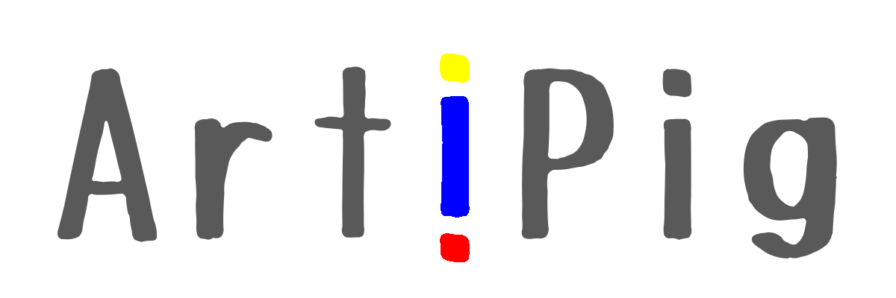

    <!-- 

 -->
    
Artificial Pigment

<a href="#/README" class="member"><i class="fa fa-bug"></i>&nbsp;&nbsp;写在前面</a>

<i class="fa fa-street-view"></i>&nbsp;&nbsp;哈德良</a>

    

        <a href="#/hdl/回家" class="works">回家</a>
    

<i class="fa fa-puzzle-piece"></i>&nbsp;&nbsp;羊须

    

        <a href="#/yx/红灯" class="works">红灯</a>
        <a href="#/yx/狐山" class="works">狐山</a>
    

<i class="fa fa-spinner"></i>&nbsp;&nbsp;里加

<i class="fa fa-bicycle"></i>&nbsp;&nbsp;阿贵

    

        <a href="#/ag/我看尚武精神" class="works">我看“尚武精神”</a>
    

<i class="fa fa-puzzle-piece"></i>&nbsp;&nbsp;午儿

<i class="fa fa-arrow-circle-up"></i>&nbsp;&nbsp;something bigger than ourselves

